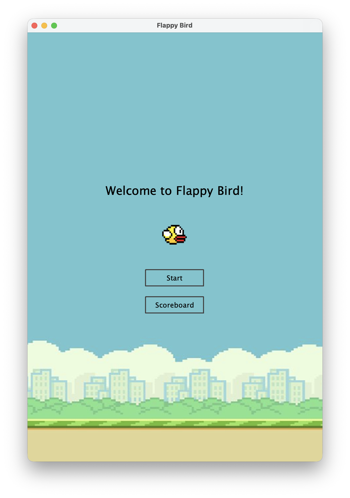
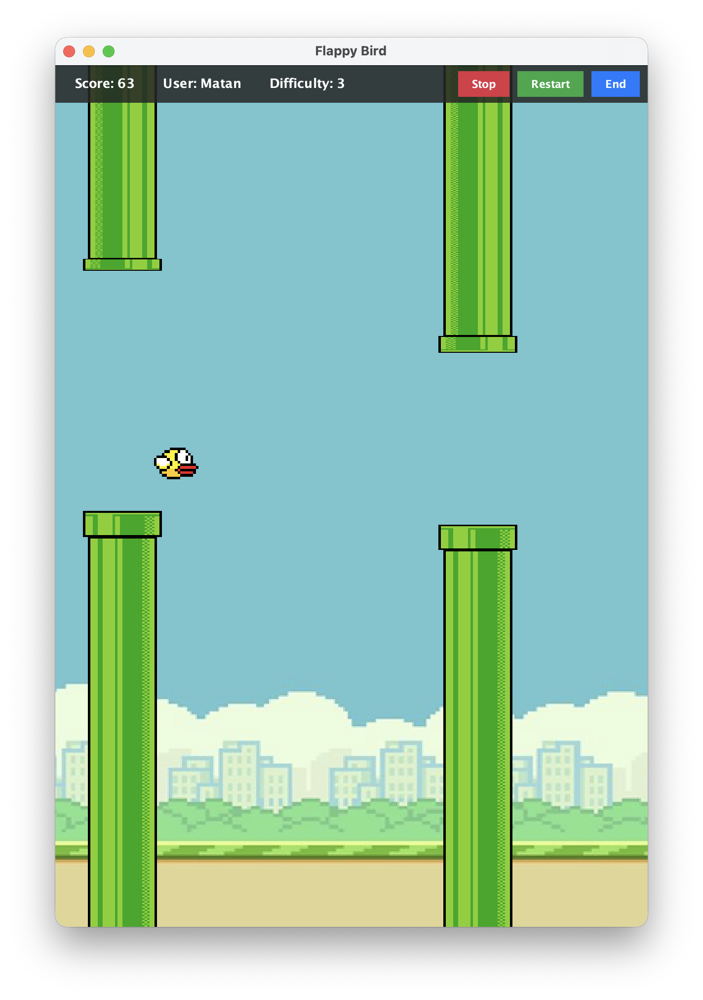
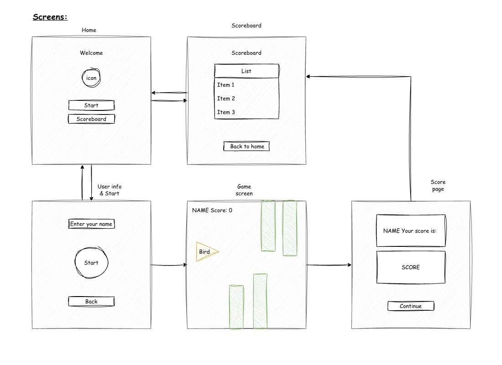

## Summary
A simple Flappy Bird clone implemented in Java for the sake of practice. This project features basic game mechanics, score tracking, and difficulty settings. Run and enjoy the game, or explore the code to learn more about Java game development.


## Folder Structure

The workspace contains two folders by default, where:

- `src`: the folder to maintain sources
- `lib`: the folder to maintain dependencies

Meanwhile, the compiled output files will be generated in the `bin` folder by default.

> If you want to customize the folder structure, open `.vscode/settings.json` and update the related settings there.


## Prerequisites

- **JDK 14+** (JDK 21 recommended) — [Download](https://adoptium.net/)

## Running the Game

### Option 1: From source
```bash
javac -d bin -sourcepath src src/**/*.java src/*.java && java -cp bin FlappyBird
```

### Option 2: Build & run a JAR
```bash
javac -d bin -sourcepath src src/**/*.java src/*.java
jar cvfm FlappyBird.jar manifest.txt -C bin . -C assets .
java -jar FlappyBird.jar
```

### Option 3: Standalone app (no Java install needed for end users)

**macOS:**
```bash
jpackage --input . --name FlappyBird --main-jar FlappyBird.jar --main-class FlappyBird --type app-image --dest output
```
Creates `output/FlappyBird.app` — double-click to run.

**Windows:**
```bash
jpackage --input . --name FlappyBird --main-jar FlappyBird.jar --main-class FlappyBird --type app-image --dest output
```
Creates `output/FlappyBird/FlappyBird.exe`.

> `jpackage` must be run on the target OS. A GitHub Actions workflow is included at `.github/workflows/build-exe.yml` to build the Windows version remotely.

## Screenshots
 

## Game Flow & Logic Overview

The diagram below illustrates the flow of game mechanics and core business logic:

